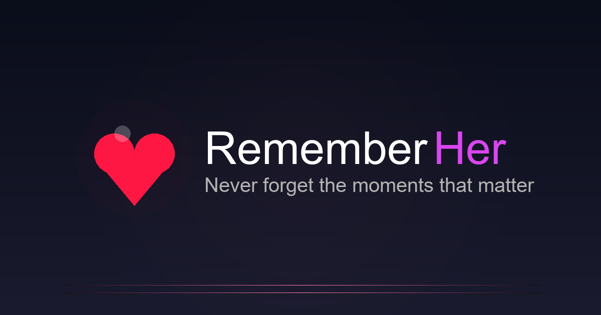

<div align="center">



# RememberHer · Marketing Website
**Never forget the moments that matter.**  
Production-grade landing page for the RememberHer mobile app.

---

**⚠️ PROPRIETARY CODE - UNAUTHORIZED USE PROHIBITED**

Copyright (c) 2024 RememberHer. All rights reserved.

This repository contains proprietary code for the RememberHer marketing website.  
This code is made available publicly for transparency and reference purposes only.  
Unauthorized use, copying, modification, or distribution is strictly prohibited.

See [LICENSE](LICENSE), [NOTICE](NOTICE), and [COPYRIGHT](COPYRIGHT) for details.

---

</div>

## ✨ Overview

This repository houses the marketing site for [RememberHer](https://rememberher.app), an AI-powered relationship companion that keeps important moments, preferences, and gift ideas top of mind. The site is fully responsive, brand-aligned, SEO-ready, and deployable to Vercel with zero additional configuration.

**Download the app:** [App Store](https://apps.apple.com/us/app/rememberher-relationship-ai/id6755442535)

## 🧱 Tech Stack

| Layer        | Details                                  |
|--------------|-------------------------------------------|
| Framework    | Next.js 15 (App Router, TypeScript)       |
| Styling      | Tailwind CSS v4 + `@tailwindcss/postcss` + custom gradients |
| Fonts        | Geist Sans / Geist Mono via `next/font`   |
| SEO          | Next.js Metadata API, `next-seo`, `next-sitemap` |
| Analytics    | Vercel Analytics                          |
| Tooling      | Turbopack, ESLint 9, npm scripts          |

## 🧩 Key Features

- **Hero Section**: Full-viewport hero with chat-style mobile UI mockup, dual CTAs, and brand-aligned gradients
- **Feature Showcase**: Partner Management, Smart Reminders, Gift Center, and Date Ideas sections with 2-column layouts
- **Content Sections**: Highlights, AI & Security, "How it works" timeline, audience personas, and comprehensive FAQ
- **Waitlist Form**: Email capture with optimistic success messaging (ready for backend integration)
- **Legal Pages**: Privacy Policy & Terms of Use with dynamic last-updated timestamps and brand styling
- **Navigation**: Sticky header with smooth scrolling, responsive mobile menu
- **SEO Optimized**: Comprehensive metadata, structured data (JSON-LD), sitemap, robots.txt, and brand-matched OG images
- **PWA Ready**: Web manifest, favicon, and Apple touch icons

## 📂 Project Structure

```
src/
 ├─ app/
 │   ├─ page.tsx          # Landing page
 │   ├─ layout.tsx        # Global layout & metadata
 │   ├─ privacy/page.tsx  # Privacy Policy
 │   └─ terms/page.tsx    # Terms of Use
 ├─ components/
 │   ├─ layout/           # Header, Footer
 │   ├─ marketing/        # Landing sections
 │   ├─ seo/              # Structured data helper
 │   ├─ ui/               # Buttons, badges, sections, cards
 ├─ lib/                  # Utilities
public/
 ├─ og-image.png          # OG/Twitter sharing image
 ├─ icon-192.png / icon-512.png / apple-touch-icon.png
 └─ site.webmanifest
```

## 🚀 Getting Started

```bash
npm install
npm run dev
# Visit http://localhost:3000
```

**Scripts**

- `npm run dev` – Start local dev server (Turbopack)
- `npm run build` – Production build + sitemap/robots generation
- `npm run start` – Serve production build
- `npm run lint` – ESLint checks

## 🔎 SEO & Metadata

- **Next.js Metadata API**: Comprehensive setup with canonical URLs, icons, robots directives, keywords, manifest, and Open Graph/Twitter Card tags
- **Structured Data**: JSON-LD via `next-seo` (`OrganizationJsonLd`, `ProductJsonLd`, `FAQJsonLd`) for rich search results
- **Automated SEO Files**: Sitemap and robots.txt generation via `next-sitemap` (runs post-build)
- **Brand Assets**: Custom OG image, favicon, Apple touch icons, and PWA icons matching the RememberHer brand
- **Security Headers**: CSP, HSTS, X-Frame-Options, and other security headers configured in `next.config.ts`

## 📨 Waitlist Form

The waitlist form (`src/components/marketing/WaitlistForm.tsx`) currently logs emails to the console and displays a success message. 

**To integrate with a backend:**
1. Replace the `handleSubmit` function in `WaitlistForm.tsx`
2. Connect to your preferred service:
   - **Supabase**: Use Supabase client to insert into a table
   - **Email Service**: Send to Mailchimp, ConvertKit, SendGrid, etc.
   - **API Route**: Create a Next.js API route (`/api/waitlist`) for custom handling

**Example API route structure:**
```typescript
// app/api/waitlist/route.ts
export async function POST(request: Request) {
  const { email } = await request.json();
  // Add your integration logic here
  return Response.json({ success: true });
}
```

## 📦 Deployment

### Vercel (Recommended)

1. Push your code to GitHub/GitLab/Bitbucket
2. Import the repository in [Vercel](https://vercel.com/)
3. Vercel will automatically detect Next.js and configure build settings
4. Deploy! The site will be live at `https://your-project.vercel.app`

### Manual Build

```bash
npm run build    # Generates sitemap, robots.txt, and optimized build
npm run start    # Test production build locally
```

**Build Output:**
- Optimized Next.js production build
- `public/sitemap.xml` and `public/sitemap-0.xml`
- `public/robots.txt`
- Static pages pre-rendered

### Post-Deployment

1. Validate OG/Twitter cards:
   - [Facebook Sharing Debugger](https://developers.facebook.com/tools/debug/)
   - [Twitter Card Validator](https://cards-dev.twitter.com/validator)
2. Test SEO: Check sitemap at `https://rememberher.app/sitemap.xml`
3. Monitor analytics via Vercel Analytics dashboard

## ✅ Status Checklist

- [x] Responsive hero & feature layouts with mobile-first design
- [x] Sticky navigation with smooth scrolling
- [x] Legal pages (Privacy Policy & Terms) with dynamic timestamps
- [x] Comprehensive SEO (structured data, sitemap, robots.txt)
- [x] Brand-consistent assets (OG image, favicons, icons)
- [x] Vercel Analytics integration
- [x] Security headers configured
- [x] Copyright protection and licensing files
- [x] Production-ready build configuration

## ⚖️ License & Copyright

**Copyright (c) 2024 RememberHer. All rights reserved.**

This repository contains proprietary code. This code is made available publicly for transparency and reference purposes only. Unauthorized use, copying, modification, or distribution is strictly prohibited.

See [LICENSE](LICENSE), [NOTICE](NOTICE), and [COPYRIGHT](COPYRIGHT) for complete terms.

For licensing inquiries: **hello@rememberher.app**

---

Built with ❤️ so thoughtful partners never miss a moment.
